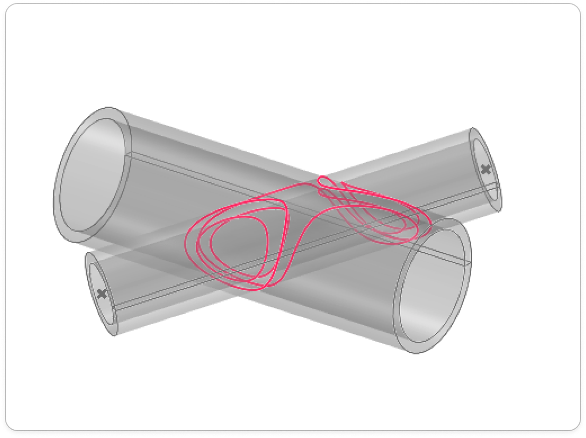

# mmcore
## Overview
Everything that is deprecated or uses deprecated components has been removed from this version. 
We managed to get rid of a lot of dependencies, some of which, for example, made it impossible to build on pypy3. 
The main goal is to improve this version to the dev functionality (which is actually used) but more efficiently and in accordance with the current concept. 

## Installation

To install a version from this particular branch, use the following:

### CPython 

```bash
python3 -m pip install --user --force-reinstall git+https://github.com/contextmachine/mmcore.git@tiny
```
All versions from 3.9 onwards are supported.
### PyPy
Since we can support pypy3 on this branch you can 
```bash
pypy3 -m pip install --user --force-reinstall git+https://github.com/contextmachine/mmcore.git@tiny
```
At this point, don't expect much performance improvement as we are still using a lot of numpy (we will move away from this in the future, but not to the detriment of performance on the cpython version)
### Docker
```bash
docker pull ghcr.io/contextmachine/mmcore.git:tiny
```


## Content
Some useful hints:
- `mmcore.api` - User API like common CAD systems.

- `mmcore.geom` - Data structures representing geometric objects
  - `mmcore.geom.curves` - Representations of curves in parametric form
  - `mmcore.geom.curves.curve` - Basic curve class in parametric form that implements many useful methods
  - `mmcore.geom.curves.bspline` - **B-Spline** curves and **NURBS** curves
  - `mmcore.geom.surfaces` - Representations of surfaces in parametric form
  - `mmcore.geom.implicit` - Implicit representations [[1]](https://en.wikipedia.org/wiki/Implicit_curve)  of curves and surfaces  
  - `mmcore.geom.implicit.dc` - **Adaptive Dual Contouring** algorithm [[2]](https://www.cs.wustl.edu/~taoju/research/interfree_paper_final.pdf) , so far in 2D. 
  - `mmcore.geom.implicit.tree` - Octree approximation for shapes in implicit form (like libfive [[3]](https://github.com/libfive/libfive)), so far in 2D.  
  - `mmcore.geom.bvh` - Implementation of BVH tree construction and queries. This can be extremely useful for intersectionb nearest neighbor search and other spatial tasks. 
  - `mmcore.geom.primitives` -Built-in high-performance primitives 
- `mmcore.numeric` - Implementation of fundamental numeric CAD algorithms and some data structures. 
 
  - `mmcore.numeric.fdm` - Automatic differentiation using **Finite Difference Method**. This also includes the gradient, jac, hessian calculation methods.
  - `mmcore.numeric.marching` - Marching method
  - `mmcore.numeric.plane` - Useful procedures for working with planes and coordinate systems
  - `mmcore.numeric.algorithms` - Fundamental CAD algorithms such as `curve_point`, `surface_point`, `intersection_curve_point`, `point_inversion` and others
  - `mmcore.numeric.closest_point` - Currently includes implementation of the algorithm for finding the **Closest Point on Curve**, **Parametric Surface Foot Point Algorithm** [[4]](Geometry and Algorithms for COMPUTER AIDED DESIGN, p. 94), etc.
  - `mmcore.numeric.curve_intersection` - Algorithms for finding all intersection points between two curves. All cases (Implicit-Implicit,Parametric-Implicit,Parametric-Parametric) are provided.
  - `mmcore.numeric.surface_intersection` - Algorithms for finding all intersection curves between two Surface. AThe following cases are currently available: Implicit-Implicit, Parametric-Parametric(Work in progress) are provided.

## Benchmarks
We managed to run several benchmarks and the results are shown in the figure. I measured the speed of the operation of finding all curves of intersection of two solid tubes with some wall thickness. You can see an illustration of this operation next to the table. We compared the capabilities of `mmcore` with Rhino, since Rhino is available on macos. These benchmarks are not exhaustive but emphasize the possibility of achieving competitive CAD engine performance on python.

| task  size | cpu  | 	Rhino 8 (sec.) | 	mmcore (sec.) | 	 Rhino 8 (sec./it.)	 | mmcore (sec./it.) |
|------------|------|-----------------|----------------|-----------------------|-------------------|
| 1          | 	1	  | 0.027           | 	0.033         | 	0.027                | 	0.033            |
| 100        | 	1	  | 2.685           | 	1.571         | 	0.027                | 	0.016            |
| 100        | 	10	 | 0.938           | 	0.275         | 	0.0095               | 	0.0027           |
| 1000       | 	10	 | 13.4            | 	2.313         | 	0.0134               | 	0.0023           |
  



## References
1. https://en.wikipedia.org/wiki/Implicit_curve
2. https://en.wikipedia.org/wiki/Implicit_curve
3. https://github.com/libfive/libfive/blob/master/libfive
4. Geometry and Algorithms for COMPUTER AIDED DESIGN, p. 94
