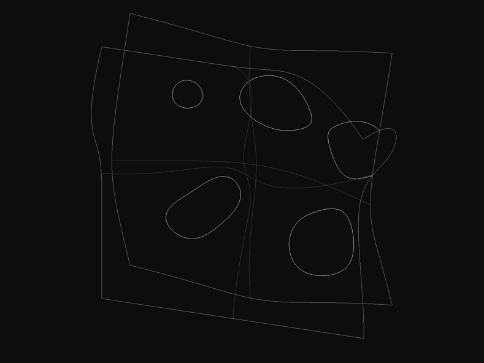

# mmcore

[](https://github.com/contextmachine/mmcore/actions/workflows/poetry-build.yml)
[](https://github.com/contextmachine/mmcore/actions/workflows/docker-publish.yml) 
[](https://opensource.org/licenses/Apache-2.0)
[](https://pypi.python.org/project/mmcore)
[](https://pypi.python.org/project/mmcore)



## Overview

mmcore is a modern CAD engine written in Python with performance-critical parts implemented in Cython. The main goal is to make advanced CAD capabilities as accessible and easy to use as popular scientific computing libraries like scipy and scikit-learn.

The library provides a comprehensive set of geometric modeling tools, numerical algorithms, and optimization methods specifically designed for CAD applications. It features efficient implementations of NURBS geometry, surface analysis, intersection algorithms, and more.

**Note:** mmcore is under active development and does not currently guarantee backwards compatibility. The API may change significantly between versions.

## Key Features

- **Geometric Modeling**
  - Complete NURBS curves and surfaces implementation
  - Advanced surface analysis with fundamental forms
  - Comprehensive intersection algorithms
  - Implicit geometry support with boolean operations
  - Primitive shapes and surface analysis tools

- **Numerical Methods**
  - General purpose optimization algorithms (Newton method, divide-and-conquer)
  - Robust numerical integration (RK45 and alternatives)
  - Interval arithmetic support
  - Advanced intersection algorithms for curves and surfaces
  - CAD-specific computational geometry algorithms
  
- **Performance Optimization**
  - Critical algorithms implemented in C/C++/Cython 
  - Fastest NURBS implementation in python.
  - BVH (Bounding Volume Hierarchy) for efficient spatial queries
  - Vectorized operations outperforming numpy for 2D-4D cases

## Implementation Examples

### 1. Surface Point Projection
```python
from mmcore.geom.surfaces import Ruled
from mmcore.numeric import surface_closest_point_vectorized_approach

# Create a ruled surface
surface = create_ruled_from_points(control_points, degree=3)

# Find closest points on surface (vectorized for performance)
closest_points = surface_closest_point_vectorized_approach(surface, points)
```

### 2. Implicit Geometry
```python
from mmcore.geom.implicit import Implicit2D

class Circle(Implicit2D):
    def __init__(self, center, radius):
        self.center = center
        self.radius = radius
        
    def implicit(self, xy):
        x, y = xy
        return (x - self.center[0])**2 + (y - self.center[1])**2 - self.radius**2
```

## Installation

### Using pip (Python 3.9+)

```bash
python3 -m pip install --user --force-reinstall git+https://github.com/contextmachine/mmcore.git@tiny
```

### PyPy Support
```bash
pypy3 -m pip install --user --force-reinstall git+https://github.com/contextmachine/mmcore.git@tiny
```

### Docker
```bash
docker pull ghcr.io/contextmachine/mmcore.git:tiny
```

## Project Structure

### Core Modules

- **mmcore.geom**: Geometric primitives and operations
  - `nurbs.pyx/pxd`: NURBS curves and surfaces implementation
  - `surfaces`: Surface analysis and fundamental forms
  - `primitives`: Basic geometric primitives
  - `implicit`: Implicit geometry with boolean operations
  - `bvh`: Spatial acceleration structures

- **mmcore.numeric**: Algorithms and computations
  - `algorithms`: Optimization and fundamental CAD algorithms
  - `integrate`: Numerical integration (RK45 and others)
  - `interval`: Interval arithmetic implementation
  - `intersections`: Comprehensive intersection algorithms (curve x curve, curve x surface, surface x surface)
  - `vectors`: High-performance vector operations
  
  
### Additional Components

- **mmcore.api**: High-level interface for common operations (WIP)
- **mmcore.renderer**: Visualization capabilities  (WIP)
- **mmcore.topo**: Topological operations and mesh handling  (WIP)

## Getting Started

1. Start with the basic examples in `examples/`:
   - `surface_closest_points.py`: Surface analysis and optimization
   - `primitives/`: Basic geometric shape creation
   - `ssx/`: Surface-surface intersection examples
   - `implicit_intersections.py`: Working with implicit geometry

2. Check the comprehensive tutorials in `notes/`:
   - [surface_closest_point.md](./notes/surface_closest_point.md): Detailed algorithm explanations
   - Additional implementation examples and best practices

## Dependencies

### Core Requirements
- Python >= 3.9
- numpy
- scipy
- earcut
- pyquaternion
- more-itertools

### Optional Components
- Development: Cython
- Visualization: plotly, kaleido, pyopengl, pyrr, glfw
- Interactive: IPython

## Performance Benchmarks

Comparison with Rhino 8 for intersection curve computation between solid tubes:

| Task Size | CPU Cores | Rhino 8 (sec.) | mmcore (sec.) | Speed Ratio |
|-----------|-----------|----------------|---------------|-------------|
| 1         | 1         | 0.027         | 0.033         | 0.82x       |
| 100       | 1         | 2.685         | 1.571         | 1.71x       |
| 100       | 10        | 0.938         | 0.275         | 3.41x       |
| 1000      | 10        | 13.4          | 2.313         | 5.79x       |

Results show mmcore excels particularly in parallel processing and batch operations.


*Figure: Visualization of tube intersection test case*

## Known Deprecations

1. Use `mmcore.numeric.vectors` instead of `mmcore.geom.vec` for vector operations
2. Prefer `NURBSCurve` over `NURBSSpline` for better algorithms and serialization
3. For curve-surface intersection, use `mmcore/numeric/intersections/csx/_ncsx.py`
4. Surface-surface intersection (SSX) implementation is currently reliable only for NURBS surfaces

## Contributing

Contributions are welcome! Please note:

1. The project is under active development
2. Breaking changes may occur between versions
3. Test all changes thoroughly before submitting
4. Follow the existing code style and documentation patterns

## License

Licensed under the Apache License, Version 2.0 - see [LICENSE](LICENSE) for details.