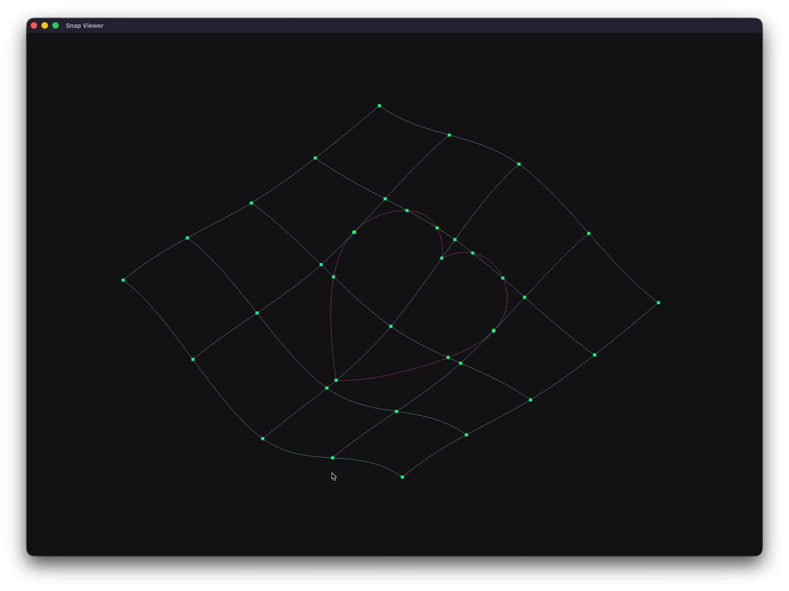
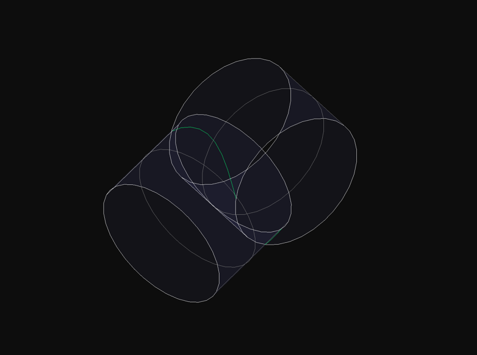
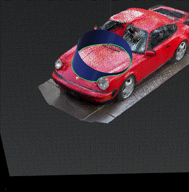
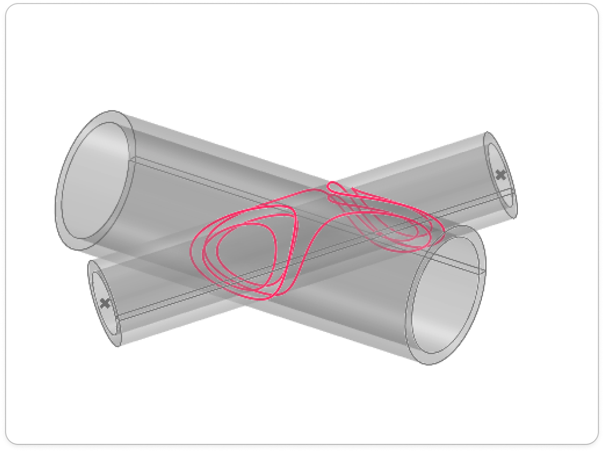

# mmcore

[](https://github.com/contextmachine/mmcore/actions/workflows/poetry-build.yml)
[](https://github.com/contextmachine/mmcore/actions/workflows/docker-publish.yml) 
[](https://opensource.org/licenses/Apache-2.0)
[](https://pypi.python.org/project/mmcore)
[](https://pypi.python.org/project/mmcore)


<!-- TOC -->
* [mmcore](#mmcore)
  * [Overview](#overview)
  * [Key Features](#key-features)
  * [Installation](#installation)
    * [Using pip (Python 3.9+)](#using-pip-python-39)
    * [PyPy Support](#pypy-support)
    * [Docker](#docker)
  * [Project Structure](#project-structure)
    * [Core Modules](#core-modules)
    * [Additional Components](#additional-components)
  * [Getting Started](#getting-started)
  * [Implementation Examples](#implementation-examples)
    * [1. Parametric Representations](#1-parametric-representations)
    * [2.Geometry Construction](#2geometry-construction)
    * [3. Basic CAD Algorithms](#3-basic-cad-algorithms)
      * [Closest Point Example](#closest-point-example)
    * [4. Advance CAD Algorithms](#4-advance-cad-algorithms)
      * [SSX Example](#ssx-example)
    * [5. Implicit Representation](#5-implicit-representation)
    * [6. CAD Algorithms for Implicits](#6-cad-algorithms-for-implicits)
  * [Dependencies](#dependencies)
    * [Core Requirements](#core-requirements)
    * [Optional Components](#optional-components)
  * [Known Deprecations](#known-deprecations)
  * [Contributing](#contributing)
  * [License](#license)
<!-- TOC -->
## NEW in 0.53.0
### Intersection algorithms improvements




### CSX overlaps handling
The nurbs_csx implementation now correctly handles overlaps (see image below).


The example shown in the figure can be found in [./examples/csx/overlap_nurbs_intersection_3.py](./examples/csx/overlap_nurbs_intersection_3.py)

### NURBS SSX improvements 
- Rational cases are fully processed.
- Significantly improved robustness. 
- Tangential intersections no longer cause branches to be interrupted. For example, [here](./examples/ssx/nurbs_nurbs_intersection_2.py).
At the detect intersections stage, a bug in the gjk implementation that led to false negatives in a number of cases has been fixed.
На этапе, detect intersections исправлен баг в реализации gjk, приводивший к ложноотрицательному выходу в ряде случаев
- Added 9 usage examples covering various cases.
- The implementation of the march method has been brought more into line with the (validated ode solver described here)[https://www.cad-journal.net/files/vol_1/CAD_1%281-4%29_2004_449-457.pdf].
- Adaptive refinement is now used instead of the march method to construct a single intersection branch.
- 
<div style="display:flex; align-items:flex-start; gap:0.75rem;">
  
  
  
</div>


### Significantly expanded NURBS construction methods
...

### Redesign of the NURBS object system
...

## Overview

mmcore is a modern CAD engine written in Python with performance-critical parts implemented in Cython. The main goal is to make advanced CAD capabilities as accessible and easy to use as popular scientific computing libraries.

The library provides a comprehensive set of geometric modeling tools, numerical algorithms, and optimization methods specifically designed for CAD applications. It features efficient implementations of NURBS geometry, surface analysis, intersection algorithms, and more.

**Note:** mmcore is under active development and does not currently guarantee backwards compatibility. The API may change significantly between versions.

## Key Features
> accuracy corresponds to commercial CAD engines
- Parametric Representations (NURBS)
  - NURBS curves and surfaces (only nurbs supported)
    - Basic NURBS operations
      - evaluation
      - knots operations
      - degree operations
      - interpolation
      - extend  (curve, surface)
      - offset (curve, surface)
    - Advanced NURBS operations
      - reparametrization
      - Change of basis (to/from monomial, to/from scaled bernstein)
      - Exact composition
      - Gauss-maps
      - Implicitization (ruled surfaces only)
    - Construction
      - base primitives (circle,arc,sphere,cylinder,torus,...)
      - ruled
      - revolution
    - Differential operations
      - General differential operation for curves and surface (Fundamental forms, metric tensor, etc.)
      - Curvatures (curve, surface, sectional)
      - Parameter space tolerance evaluation
      - adaptive approximation/tessellation
    - CAD algorithms 
      - Closest point (robust, curve/surface)
      - Intersection
        - CCX (curve-curve intersection, all points and overlaps)
        - CSX (curve-surface intersection, all points, overlaps detection WIP )
        - SSX (surface-surface intersection, all intersection branches)
      - Geometric properties
        - Curve length
        - Curve area (closed planar NURBS curve)
        - Surface area (closed planar NURBS curve)
        - Area of surface (WIP)
        - Area of trimmed surface (WIP)
- Implicit Representations 
  - Evaluation (value,gradient)
  - User-defined implicit functions support
  - Boolean operations (union, intersection, difference, xor)
  - Implicit approximation
  - CAD algorithms
      - Closest point on 2d/3d implicit
      - Closest point on intersection curve between 3d implicits
      - Intersection (Fairly fast)
        - 2d x 2d
        - 3d x 3d 
  - Tessellation
    - marching cubes
- Topology (WIP)
- Compat
  - STEP (write, NURBS only)

* exact: corresponds to commercial CAD engines *
    
## Installation

### Using pip (Python 3.9+)

```bash
python3 -m pip install --user --force-reinstall git+https://github.com/contextmachine/mmcore.git@tiny
```

### PyPy Support
```bash
pypy3 -m pip install --user --force-reinstall git+https://github.com/contextmachine/mmcore.git@tiny
```

### Docker
```bash
docker pull ghcr.io/contextmachine/mmcore.git:tiny
```

## Project Structure

### Core Modules

- **mmcore.nurbs**: the NURBS core
  - `_nurbs_eval`: `NURBSCurveTuple` / `NURBSSurfaceTuple` — the primary, named-tuple representation, readable and debuggable
  - `_nurbs_knots`, `_nurbs_ders`, `_nurbs_interp`, `_nurbs_join`, `_nurbs_construct`, `_nurbs_transform`, `nurbs_iso`: knot algebra, derivatives, interpolation, joining, construction, transforms, iso-curves
  - `_core.pyx`: the C++ `NURBSCurve` / `NURBSSurface` classes (Cython accelerator)
- **mmcore.implicit**: implicit geometry with boolean operations and dual contouring
- **mmcore.numeric**: algorithms and computations
  - `intersection`: the solver families — `ccx` (curve x curve), `csx` (curve x surface), `ssx` (surface x surface) — one entry point each
  - `bvh`: spatial acceleration structures
  - `closest_point` / `_bez_closest_point`: closest-point solvers (squared-distance Bernstein nets)
  - `algorithms`, `interval`, `integrate`, `vectors`: fundamental CAD algorithms, interval arithmetic, integration, high-performance vector ops
- **mmcore.construction**: high-level builders — `ruled`, `revolved`, `sweep`, `torus`, `cylinder`, `circle`, `loft`
- **mmcore.topo**: BRep topology (Euler operators, STEP-ready), meshing
- **mmcore.compat**: STEP I/O
- **mmcore.extras**: optional leaf integrations (renderer, rhino, occ, torch)
  
### Additional Components

- **mmcore.api**: High-level interface for common operations (WIP)
- **mmcore.renderer**: Visualization capabilities  (WIP)
- **mmcore.topo**: Topological operations and mesh handling  (WIP)

## Getting Started
1. Start with short introduction in the [Implementation Examples](#implementation-examples)

2. Check the basic examples in `examples/`:
   - `surface_closest_points.py`: Surface analysis and optimization
   - `primitives/`: Basic geometric shape creation
   - `ssx/`: Surface-surface intersection examples
   - `implicit_intersections.py`: Working with implicit geometry

3. Check the short introduction in the [Implementation Examples](#implementation-examples):
   - [surface_closest_point.md](./notes/surface_closest_point.md): Detailed algorithm explanations
   - Additional implementation examples and best practices

## Implementation Examples
### 1. Parametric Representations

We recommend using NURBS as parametric representations, Although procedural parametric representations are also supported for many operations, due to their properties NURBS representations can be used in algorithms requiring strict robustness.
```python
# The named-tuple ABI is the primary representation:
from mmcore.nurbs._nurbs_eval import NURBSCurveTuple, NURBSSurfaceTuple
# The Cython classes remain available for performance-critical paths:
from mmcore.nurbs._core import NURBSCurve, NURBSSurface
```

### 2.Geometry Construction
This creates a simple NURBS curve of degree 3 on 10 control points:
```python
import numpy as np
from mmcore.nurbs._core import NURBSCurve
curve = NURBSCurve(np.random.random((10,3)))
```

```python

from mmcore.nurbs._core import NURBSCurve
from mmcore.construction import ruled
# Create forming curves
curve1=NURBSCurve(...)
curve2=NURBSCurve(...)
# Create a ruled surface
surface = ruled(curve1,curve2)

```
### 3. Basic CAD Algorithms

#### Closest Point Example
This example demonstrates such a base operation as closest point on surface
```python
import numpy as np
from mmcore.numeric._bez_closest_point import nurbs_surface_closest_points
# Surface construction
surface = ...

# A query point
point = np.array([0.5, 0.5, 1.0])

# The SET of globally closest entities within d_min + atol
# (points, degenerate curves, or whole patches - never far local minima):
result = nurbs_surface_closest_points(surface, point, atol=1e-6)

```
You can find a detailed algorithm explanation here [surface_closest_point.md](./notes/surface_closest_point.md)

### 4. Advance CAD Algorithms
Algorithms for finding all intersections are fundamental in CAD.  In mmcore there are robust implementations for parametric NURBS objects:
- **CCX** (Curve Curve Intersection)  
- **CSX** (Curve Surface Intersection)
- **SSX** (Surface Surface Intersection)

Also in experimental mode there are implementations for implicit and procedural objects. However, at the moment it is not guaranteed to find all intersections in the general case (we are working on it).
#### SSX Example

```python
from mmcore.numeric.intersection.ssx import nurbs_ssx
# Surfaces construction (NURBSSurfaceTuple or NURBSSurface)
surface1 = ...
surface2 = ...

# Perform Surface x Surface Intersection
result = nurbs_ssx(surface1, surface2, atol=0.001)
result['branches']   # intersection curves (SSXBranch: curve_xyz / curve_st / curve_uv)
result['points']     # isolated intersection points
result['complete']   # read this before trusting the output as the whole truth
```

You can find full examples at [examples/ssx/nurbs_nurbs_intersection_1.py](examples/ssx/nurbs_nurbs_intersection_1.py) and [examples/ssx/nurbs_nurbs_intersection_2.py](examples/ssx/nurbs_nurbs_intersection_2.py).
To display the output of the algorithm install the viewer plugin with:
```
git clone https://github.com/contextmachine/mmcore@tiny.git
cd mmcore
python3 -m venv venv
source venv/bin/activate
pip install ".[renderer]"
``` 
or
```
git clone https://github.com/contextmachine/mmcore@tiny.git
cd mmcore
python3 -m venv venv
source venv/bin/activate
pip install ".[all]"
``` 


### 5. Implicit Representation
Implicit representations are less common in commercial frame systems, but like parametric representations have long been well developed in computer graphics. General implicits are implemented in mmcore. It means that the algorithms are suitable for working with any implicits and not only with such widespread implicit forms as SDF. 

To create your own implicit object class, all you need to do is inherit from one of the base classes and override the `implicit(self,point)` and `bounds(self)` methods:
```python
from mmcore.implicit import Implicit2D

class Circle(Implicit2D):
    def __init__(self, center, radius):
        super().__init__()
        self.center = center
        self.radius = radius
    def bounds(self):
        return self.center-self.radius,self.center+self.radius # min point , max point
    def implicit(self, xy:'ndarray[float, (2,)] | ndarray[float, (3,)]'):
        x, y = xy
        return (x - self.center[0])**2 + (y - self.center[1])**2 - self.radius**2 # circle implicit equation
```
When these methods are implemented, all other methods will be generated automatically. 

An example of applying the standard algorithm for finding the intersection curve between two implicits to an implicit cylinder and a custom implicit based on a point cloud:



### 6. CAD Algorithms for Implicits
Closest point, intersections, and others algorithms are also available for implicits in both 2d and 3d cases. Intersection algorithms in 3D are particularly interesting because they show good accuracy and performance, in some cases surpassing commercial packages. 

**Performance Benchmarks:**

Comparison with Rhino 8 for intersection curves computation between solid tubes:

| Task Size | CPU Cores | Rhino 8 (sec.) | mmcore (sec.) | Speed Ratio |
|-----------|-----------|----------------|---------------|-------------|
| 1         | 1         | 0.027          | 0.033         | 0.82x       |
| 100       | 1         | 2.685          | 1.571         | 1.71x       |
| 100       | 10        | 0.938          | 0.275         | 3.41x       |
| 1000      | 10        | 13.4           | 2.313         | 5.79x       |

*In mmcore we use implicit representations, in Rhino tubes are represented by BReps.*

Results show mmcore excels particularly in parallel processing and batch operations.



*Figure: Visualization of tube intersection test case*

At the same time, I would like to remind you that these algorithms are currently not guaranteed in the general case and are under active development.

You can find the full code for this example here [examples/ssx/implicit_intersections.py](examples/ssx/implicit_intersections.py)

## Dependencies

### Core Requirements
- Python >= 3.9
- numpy
- scipy
- earcut
- pyquaternion
- more-itertools
- steputils

### Optional Components
- Development: Cython
- Visualization: plotly, kaleido, pyopengl, pyrr, glfw
- Interactive: IPython


## Known Deprecations

1. Prefer the named-tuple ABI (`NURBSCurveTuple` / `NURBSSurfaceTuple` from
   `mmcore.nurbs._nurbs_eval`) over the Cython classes for new code
2. The solver entry points are unversioned: `nurbs_ccx`, `nurbs_csx`, `nurbs_ssx`
   from `mmcore.numeric.intersection.{ccx,csx,ssx}` always bind the maintained engine
3. Surface-surface intersection (SSX) is reliable for NURBS surfaces; implicit and
   procedural support is experimental

## Contributing

Contributions are welcome! Please note:

1. The project is under active development
2. Breaking changes may occur between versions
3. Test all changes thoroughly before submitting
4. Follow the existing code style and documentation patterns


## License

Licensed under the Apache License, Version 2.0 - see [LICENSE](LICENSE) for details.