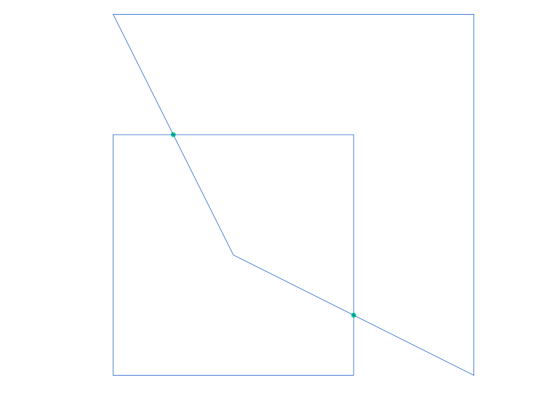

# Basic Usage

```python
import numpy as np
from mmcore.geom import polyline
```

## Define corners of a polyline

```python
corners = np.array([[0., 0., 0.], [1., 0., 0.], [1., 1., 0.], [0., 1., 0.]])
```

## Convert the polyline to a set of lines

```python
lines = polyline.polyline_to_lines(corners)
print(lines)  # Returns array of lines representing original polyline
```

## Evaluate

Evaluate polyline at t=0.5

```python
result = polyline.evaluate_polyline(corners, 0.5)
print(result)  # Returns: [0.5, 0., 0. ]
```

Evaluate polyline at t=2.5

```python
result = polyline.evaluate_polyline(corners, 2.5)
print(result)  # Returns: [0.5, 1.,  0. ]
```

## Trimming

Trim the polyline from t1=0.2 to t2=1.8

```python
trimmed = polyline.trim_polyline(corners, 0.2, 1.8)
print(trimmed)  #
```

Returns polyline trimmed down to specified range:

```
array([[0.2, 0. , 0. ],
       [1. , 0. , 0. ],
       [1. , 0.8, 0. ]])
```

## Insert points into the polyline

```python
newPoints = np.array([[0.5, 0.5, 0.], [1.5, 1.5, 0.]])
indices = np.array([1, 2])
polyline_after_insert = polyline.insert_polyline_points(corners, indices, newPoints)
print(polyline_after_insert)
```

Returns polyline with inserted points.

## Splitting

Split a closed polyline

```python
split_parts = polyline.split_closed_polyline(corners, 0.33, 1.66)
print(split_parts)

```

Returns two parts of the polyline, split by the specified parameters:

```
(array([[0.33, 0.  , 0.  ],
        [1.  , 0.  , 0.  ],
        [1.  , 0.66, 0.  ]]),
 array([[1.  , 0.66, 0.  ],
        [1.  , 1.  , 0.  ],
        [0.  , 1.  , 0.  ],
        [0.  , 0.  , 0.  ],
        [0.33, 0.  , 0.  ]]))
       
```

## Intersection

Intersection of the two polylines.

```python
corners_a = np.array([[0, 0, 0], [1, 0, 0], [1, 1, 0], [0, 1, 0]], dtype=float)
corners_b = np.array([[0.5, 0.5, 0], [1.5, 0, 0], [1.5, 1.5, 0], [0, 1.5, 0]], dtype=float)
intersection_points = polyline.polyline_intersection(corners_a, corners_b)
print(intersection_points)
```

Returns all intersections of the two polylines (if any).

```
[[1.  , 0.25, 0.  ],
 [0.25, 1.  , 0.  ]])

```



