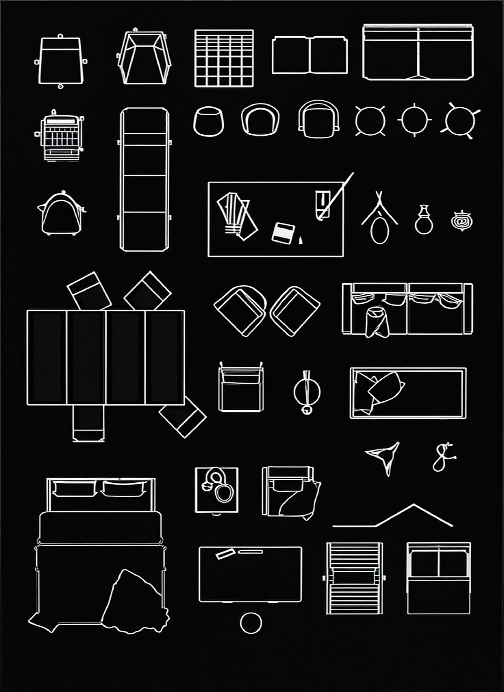

# Skeleton To Drawing Example
An example script that generates a drawing in 3dm format from a rasterized image of a drawing.


Make sure you have mmcore installed. To do this in the root of the repository:
```bash
python3 -m pip install -e .
```
If you are in the root of the repository:

```bash
cd example/toys/skeleton_drawings
```
Install trace_skeleton
```bash
chmod +x setup.sh
./setup.sh
```
Install the necessary Python dependencies (PIL, cv2, rhino3dm)
```bash
python3 -m pip install -r req.txt
```

```bash
python3 skeleton_drawings.py
```  