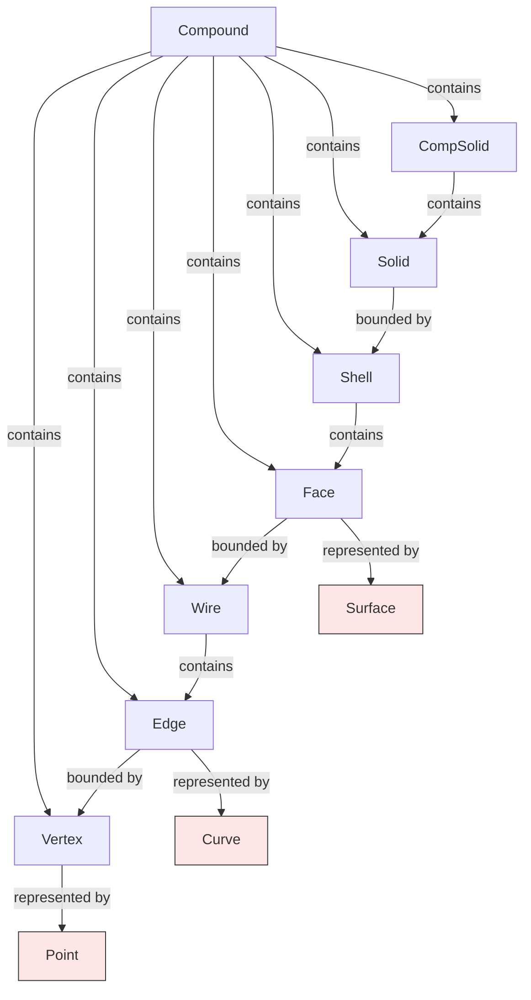

```mermaid
flowchart TD
    Vertex -- represented by --> Point
    Compound --> |contains|Vertex
  
    Compound --contains--> Edge 
    Edge -- bounded by --> Vertex
    Edge -- represented by --> Curve
    
    
    Compound --contains--> Wire          
    Compound --contains--> Face
    Compound --contains--> Shell 
    Compound --contains--> Solid
    Compound --contains--> CompSolid
    CompSolid -- contains --> Solid
    Shell -- contains --> Face
    Solid -- bounded by --> Shell
    Face -- bounded by --> Wire
    Face -- represented by --> Surface
    
    Wire -- contains --> Edge
   
    
      

 
    classDef blue fill:#ff,stroke:#33
    classDef pink fill:#FFE6E6,stroke:#333
    
    class CompSolid,Solid,Shell,Face,Wire,Edge,Vertex blue
    class Surface,Curve,Point pink
```